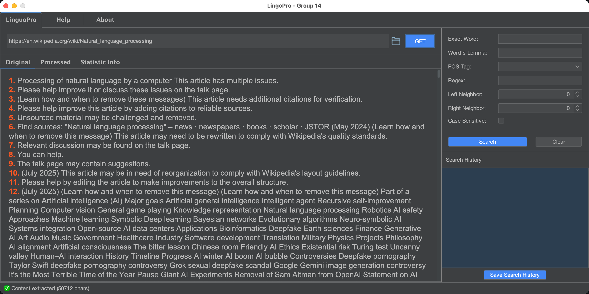
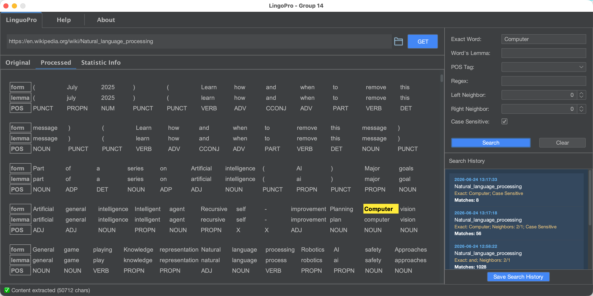
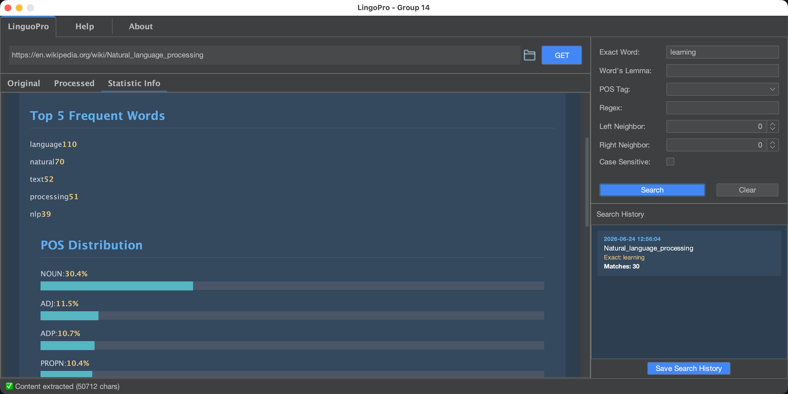
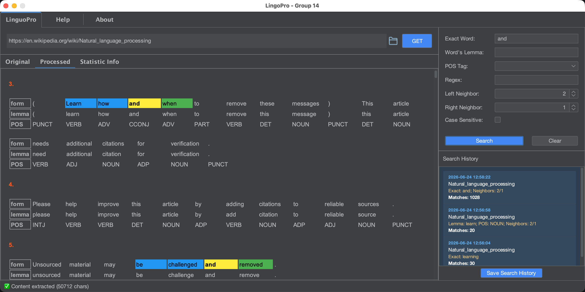
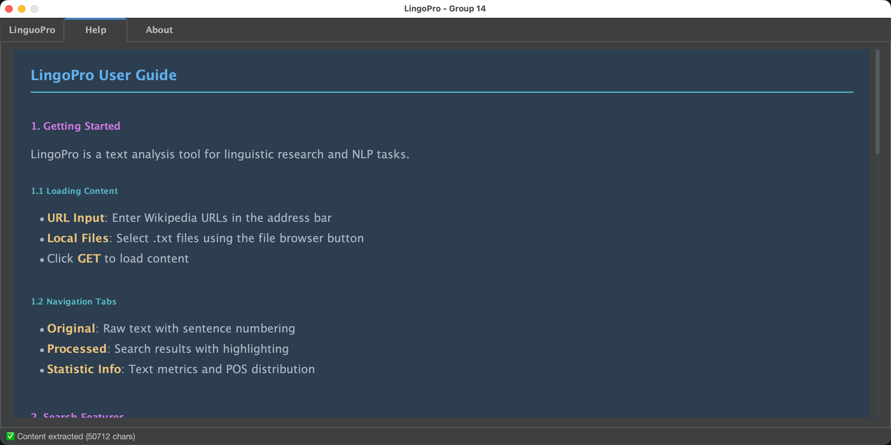
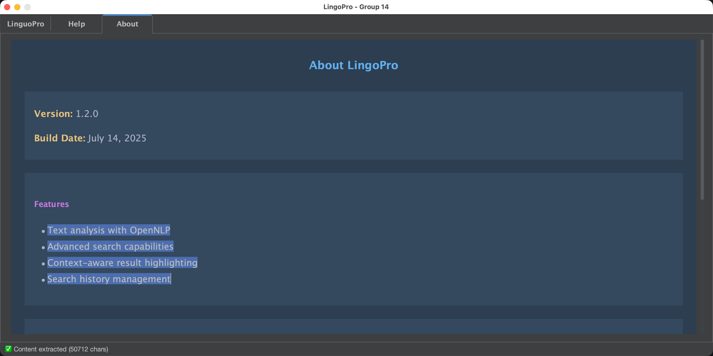

# LingoPro

**LingoPro** is a Java-based desktop NLP application developed as a four-person course project for **Data Structure and Algorithm II**. It combines a Swing GUI, OpenNLP-based text processing, web content import, advanced search conditions, contextual highlighting, search history, basic statistics, and XML export.

This repository preserves the final submitted version of the project and is presented as part of my technical portfolio, with emphasis on **Java GUI development**, **NLP tool integration**, **software packaging**, and **team-based project integration**.

## Project Overview

LingoPro was designed as a small text exploration tool for users who want to inspect English text through both standard search and basic linguistic analysis. Users can import or retrieve text, search with multiple conditions, inspect surrounding context, and view linguistic or statistical information through a desktop interface.

The application provides three main working views:

- **Original**: displays imported or web-scraped raw text with sentence numbering.
- **Processed**: shows token-level processing results, including word form, lemma, POS tag, and search highlighting.
- **Statistic Info**: presents basic frequency and POS-distribution information.

The project was completed under course constraints and submitted as an executable JAR file.

## Screenshots

### Main interface and imported text



The main interface contains a URL input bar, file import access, the three core tabs, search controls, and the search history panel.

### Processed text view



The processed view displays sentence-level results with token form, lemma, and POS-tag information.

### Statistics view



The statistics tab shows frequent words and POS distribution, making the tool more useful for quick text inspection.

### Context-aware search highlighting



Search results can be combined with left and right neighbour windows. Matches and neighbouring tokens are highlighted with different colours.

### Help page



The help page explains the basic workflow, including loading content, navigating tabs, and using search features.

### About page



The about page summarises version information and the main feature set.

## Key Features

- **Text analysis with OpenNLP**
  - Sentence detection
  - Tokenization
  - POS tagging
  - Lemmatization

- **Advanced search capabilities**
  - Exact word search
  - Regex-based search
  - Lemma-based search
  - POS-tag-based search
  - Case-sensitive / case-insensitive matching

- **Context-aware result display**
  - Left and right neighbour-window search
  - Highlighted matches and neighbouring tokens
  - Processed HTML-style result rendering inside the GUI

- **Search history management**
  - Recent search conditions are recorded and displayed
  - Search workflow can be inspected and reused during a session

- **Text statistics**
  - Basic word and sentence statistics
  - Word frequency information
  - POS distribution view

- **Input and export support**
  - Local text input
  - Web scraping for text retrieval
  - XML export for search-related data

- **User-facing desktop interface**
  - Dark themed Java Swing interface
  - Original / Processed / Statistic Info tabs
  - Help and About sections
  - Packaged as a runnable JAR file

## Technologies Used

| Area | Technology |
|---|---|
| Language | Java 11 |
| GUI | Java Swing |
| UI theme | FlatLaf |
| NLP | Apache OpenNLP |
| Web scraping | Jsoup |
| Data / export | XML, JSON / Gson |
| Build / packaging | Maven, Maven Shade Plugin |
| IDE | IntelliJ IDEA |
| Output | Executable JAR |

## My Role

This was a **four-person group project**. My main contributions focused on user interface design, GUI implementation, final integration, and packaging.

### Main contributions

- Designed the overall visual style and interface structure.
- Implemented the GUI using **Java Swing**.
- Integrated functional modules into the final desktop application.
- Took over final-stage coordination when the project needed additional integration work before submission.
- Packaged the final application as a runnable JAR file.
- Contributed to making the project presentable as a complete user-facing tool rather than only separate backend modules.

### Team context

Other team members contributed to areas including XML export, web scraping, search logic, meeting coordination, and presentation materials. Because this is a group project, this README distinguishes my personal contributions from the overall application functionality.

## Repository Structure

```text
LingoPro/
├── config/                         # Configuration files
├── ScreenShot/                     # Application screenshots for README and portfolio use
├── src/main/java/org/example/
│   ├── io/                          # Input / output and history-related logic
│   ├── process/                     # NLP analysis and search condition logic
│   ├── service/                     # Service layer connecting processing and UI
│   ├── ui/                          # Swing GUI classes
│   └── Main.java                    # Application entry point
├── src/main/resources/
│   ├── assets/                      # UI assets
│   ├── components/                  # Component configuration
│   └── models/                      # OpenNLP model files
├── target/
│   └── LingoPro_Dev6-1.0-SNAPSHOT.jar
├── pom.xml
└── dependency-reduced-pom.xml
```

## How to Run

### Option 1: Run the packaged JAR

The final JAR file is included in the `target/` directory.

```bash
java -jar target/LingoPro_Dev6-1.0-SNAPSHOT.jar
```

### Option 2: Build from source

Make sure Java 11+ and Maven are installed.

```bash
mvn clean package
java -jar target/LingoPro_Dev6-1.0-SNAPSHOT.jar
```

## macOS Gatekeeper Note

On macOS, the JAR file may be blocked because it was downloaded from an untrusted source. If macOS reports that the file is damaged or cannot be opened, remove the quarantine attribute:

```bash
xattr -d com.apple.quarantine target/LingoPro_Dev6-1.0-SNAPSHOT.jar
```

Then run it again:

```bash
java -jar target/LingoPro_Dev6-1.0-SNAPSHOT.jar
```

## Supported Platforms

The application was intended to run on:

- macOS
- Windows 10

Because this is a Java desktop application, it may also run on other systems with a compatible Java runtime, but these were not the main tested platforms for the course submission.

## Known Limitations

This repository keeps the final submitted course-project version. It is not currently planned for active refactoring. Some limitations remain:

- The GUI uses a fixed-size layout and does not fully support responsive resizing or full-screen use.
- Search result presentation could be improved for cases with very few or zero matches.
- Numeric input validation for neighbour-window fields could be stricter.
- Web-scraped text would benefit from stronger cleaning and preprocessing.
- Search performance could be improved by indexing or caching more of the processed text.
- XML export could be expanded to include full result data, not only search-related parameters.

## What I Learned

This project helped me connect my previous UI/UX background with Java software development and NLP-oriented programming. The most valuable parts for me were:

- implementing a user-facing desktop interface in Java,
- integrating separate modules into a working application,
- handling final-stage project risk under deadline pressure,
- packaging a Java application as an executable JAR,
- and understanding how NLP processing can be exposed through an interactive GUI.

For my current career transition, this project is useful evidence of practical Java development, GUI work, module integration, and applied NLP tooling.

## Course and Project Information

| Item | Information |
|---|---|
| Course | Data Structure and Algorithm II |
| Type | University course group project |
| Semester | 2nd semester |
| Team | Group 14 |
| Final output | `LingoPro_Dev6-1.0-SNAPSHOT.jar` |
| Status | Final submitted version / portfolio archive |

## License

## License

This project is released under the MIT License.

The repository contains the final submitted version of a university group project developed by Group 14 (Xianglong Liu, Jean, Qun, Shreya).

The source code is shared primarily for educational, portfolio, and demonstration purposes.

See the LICENSE file for details.
